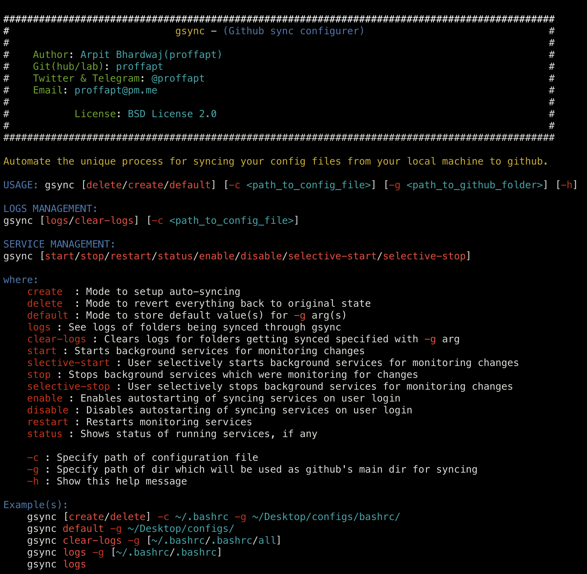

<div id="top"></div>

<!-- PROJECT SHIELDS -->
<!-- https://www.markdownguide.org/basic-syntax/#reference-style-links-->
[![Contributors][contributors-shield]][contributors-url]
[![Forks][forks-shield]][forks-url]
[![Stargazers][stars-shield]][stars-url]
[![Issues][issues-shield]][issues-url]
[![MIT License][license-shield]][license-url]
[![LinkedIn][linkedin-shield]][linkedin-url]
  
  <h3 align="center">gsync</h3>

  <p align="center">
    <i>Automate the unique process(by me) for syncing your configuration from your local machine to github.</i>
    <br />
    <a href="https://github.com/proffapt/gsync"><strong>Explore the docs »</strong></a>
    <br />
    <br />
    <a href="https://github.com/proffapt/gsync/issues">Report Bug</a>
    ·
    <a href="https://github.com/proffapt/gsync/issues">Request Feature</a>
  </p>
</div>


<!-- TABLE OF CONTENTS -->
<details>
  <summary>Table of Contents</summary>
  <ol>
    <li>
      <a href="#about-the-project">About The Project</a>
      <ul>
        <li><a href="#why-linking-config-files-?">Why linking config files ?</a></li>
      </ul>
    </li>
    <li>
      <a href="#getting-started">Getting Started</a>
      <ul>
        <li><a href="#prerequisites">Prerequisites</a></li>
        <li><a href="#installation">Installation</a></li>
      </ul>
    </li>
    <li><a href="#usage">Usage</a></li>
    <li><a href="#contributing">Contributing</a></li>
    <li><a href="#changelog">Change.log</a></li>
    <li><a href="#license">License</a></li>
    <li><a href="#contact">Contact</a></li>
    <li><a href="#acknowledgments">Acknowledgments</a></li>
  </ol>
</details>


<!-- ABOUT THE PROJECT -->
## About The Project

GSYNC is a tool for those who like to sync their configuration files in real-time to github, so how does it exactly do that? Read the code for detailed understanding.. from v1.2.1 it can be managed as if it is a kind of a service and has beautiful logs for every folder being monitored

**TIP**: Use it as a editor alias to open your fav editor and create your configuration file, it will do the job of syncing it to your github and automate this process for future use after you are done editing it.

<p align="right">(<a href="#top">back to top</a>)</p>

<div id="why-linking-config-files-?"></div>

### Why linking config files ?

- Suppose you wanna sync your .bashrc in `~/`, you will have to `git init` your `~/` which will show everywhere `(main)` in your terminal and might clash with your sub directories which are some local git projects, so yeah just move it somewhere else.. link that to original location and sync the file now

<p align="right">(<a href="#top">back to top</a>)</p>

<!-- GETTING STARTED -->
## Getting Started

To get a local copy up and running follow these simple steps.

### Prerequisites
You will need to install the following dependencies for the project to work.
* `fswatch` for macOS; `inotify-tools` for GNU+Linux
* `git`
  ```sh
  git config pull.rebase true
  git config credential.helper store
  ```
* `gh`
  - Installation
    - [OSX](https://cli.github.com/manual/installation)
    - [Linux](https://github.com/cli/cli/blob/trunk/docs/install_linux.md)
  - Configuration
  ```sh
  gh auth login
  gh auth refresh -h github.com -s delete_repo
  ```

<p align="right">(<a href="#top">back to top</a>)</p>

### Installation

_Now since we are done with the setting up of environment suitable for the project to compile/run, let's install and configure the project on your system locally now._
1. Clone the repo.
2. Make the script executable.
3. Add suitable alias for it.
   ```sh
   git clone https://github.com/proffapt/gsync.git
   cd ./gsync
   chmod +x ./gsync
   echo "alias gsync='$PWD/gsync'"
   ```
4. Add the echoed line to your shell config file.
5. Finally, source your config file

<p align="right">(<a href="#top">back to top</a>)</p>


<!-- USAGE EXAMPLES -->
## Usage

1. Execute the help menu for script
   ```sh
   gsync
   ```
<div align="center">
  <a href="https://github.com/proffapt/gsync">
    
  </a>
</div>

2. Use cases for the script are as follows:
* Create mode
  ```sh
  gsync create -c ~/config.file  -g ~/configs
  ```
  
* Delete mode
  ```sh
  gsync delete -c ~/config.file  -g ~/configs
  ```
  
* Default mode
   ```sh
   gsync default -g ~/configs
   gsync create -c ~/config.file
   gsync delete -c ~/config.file
   ```
   
* Logs management
   ```sh
   gsync clear-logs -g ~/configs
   gsync clear-logs -g configs
   gsync clear-logs -g all
   gsync logs -g ~/configs
   gsync logs -g configs
   gsync logs
   ```
   
* Service management
   ```sh
   gsync start
   gsync selective-start
   gsync stop
   gsync selective-stop
   gsync restart
   gsync status
   gsync enable
   gsync disable
   ```
  
* [**BONUS**] Folder Syncing :)
  ```sh
  gsync create -c ~/random.file -g ~/folder_to_sync
  rm ~/folder_to_sync/random.file ~/random.file
  ```
   
3. Now if you used `create` mode, edit your configuration file(`config.file` here), the syncscript will do it's job and sync the configuration file to specified github repo.
  
#### * See output screenshots of various cases in [images](https://github.com/proffapt/gsync/tree/main/images) folder.

<p align="right">(<a href="#top">back to top</a>)</p>

<!-- CONTRIBUTING -->
## Contributing

Contributions are what make the open source community such an amazing place to learn, inspire, and create. Any contributions you make are **greatly appreciated**.

If you have a suggestion that would make this better, please fork the repo and create a pull request. You can also simply open an issue with the tag "enhancement".
Don't forget to give the project a star! Thanks again!

1. Fork the Project
2. Create your Feature Branch (`git checkout -b feature/AmazingFeature`)
3. Commit your Changes (`git commit -m 'Add some AmazingFeature'`)
4. Push to the Branch (`git push origin feature/AmazingFeature`)
5. Open a Pull Request

<p align="right">(<a href="#top">back to top</a>)</p>


<!-- Changelog -->
# Changelog

## v1.3

### Added or Changed
- Completely new and robust logic for syncing changes

         - Can sync changes even when done with GUI and CLI, by any process
         - Leaves no dangling process.
- Support for automatically starting the monitoring process on login
- Elaborative and colorful logs in a separate log-file, cleared on every login
- Super convenient logs and process/service management
- Service management is more binocular, supports starting and stopping of individual processes specified by user
- Also included `enable` and `disable` modes for services

### Removed

- `-a` argument. No need for any alias now, edit however you want
- Old one way method of editing and syncing files
- Shell dependency

<p align="right">(<a href="#top">back to top</a>)</p>

<!-- LICENSE -->
## License

Distributed under the BSD-2-Clause License. See `LICENSE.txt` for more information.

<p align="right">(<a href="#top">back to top</a>)</p>


<!-- CONTACT -->
## Contact

Arpit Bhardwaj - [Twitter](https://twitter.com/proffapt) - [Telegram](https://t.me/proffapt) - proffapt@protonmail.com

Company website: [Cybernity](https://cybernity.org) - [CybernityForum](https://cybernity.group)

Project Link: [https://github.com/proffapt/gsync](https://github.com/proffapt/gsync)

<p align="right">(<a href="#top">back to top</a>)</p>


<!-- ACKNOWLEDGMENTS -->
## Acknowledgments

* [Choose an Open Source License](https://choosealicense.com)
* [Img Shields](https://shields.io)
* [GH manual](https://cli.github.com/manual/gh_repo_create)
* [sed - BSD v/s GNU/Linux](https://unix.stackexchange.com/questions/401905/bsd-sed-vs-gnu-sed-and-i)
* [Detect changes in git folder](https://stackoverflow.com/questions/13715544/shell-script-to-check-git-for-changes-and-then-loop-through-changed-files)
* [Launchd - automate things at login for mac](https://stackoverflow.com/questions/6442364/running-script-upon-login-in-mac-os-x)

<p align="right">(<a href="#top">back to top</a>)</p>


<!-- MARKDOWN LINKS & IMAGES -->

[contributors-shield]: https://img.shields.io/github/contributors/proffapt/gsync.svg?style=for-the-badge
[contributors-url]: https://github.com/proffapt/gsync/graphs/contributors
[forks-shield]: https://img.shields.io/github/forks/proffapt/gsync.svg?style=for-the-badge
[forks-url]: https://github.com/proffapt/gsync/network/members
[stars-shield]: https://img.shields.io/github/stars/proffapt/gsync.svg?style=for-the-badge
[stars-url]: https://github.com/proffapt/gsync/stargazers
[issues-shield]: https://img.shields.io/github/issues/proffapt/gsync.svg?style=for-the-badge
[issues-url]: https://github.com/proffapt/gsync/issues
[license-shield]: https://img.shields.io/github/license/proffapt/gsync.svg?style=for-the-badge
[license-url]: https://github.com/proffapt/gsync/blob/master/LICENSE.txt
[linkedin-shield]: https://img.shields.io/badge/-LinkedIn-black.svg?style=for-the-badge&logo=linkedin&colorB=555
[linkedin-url]: https://linkedin.com/in/proffapt
[product-screenshot]: .images/screenshot.png
