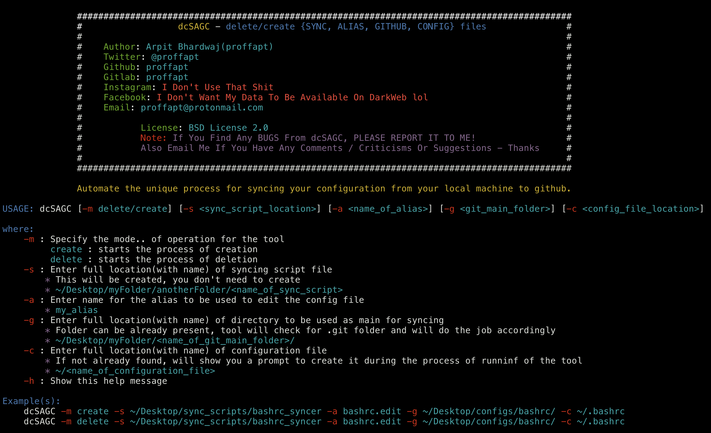
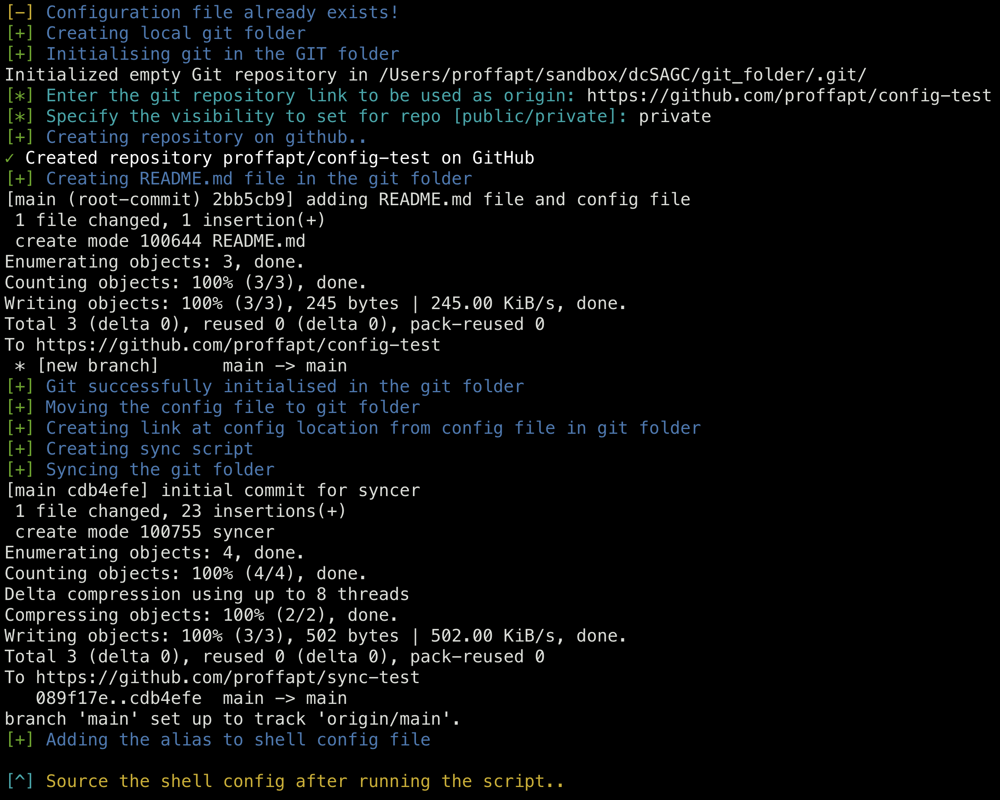
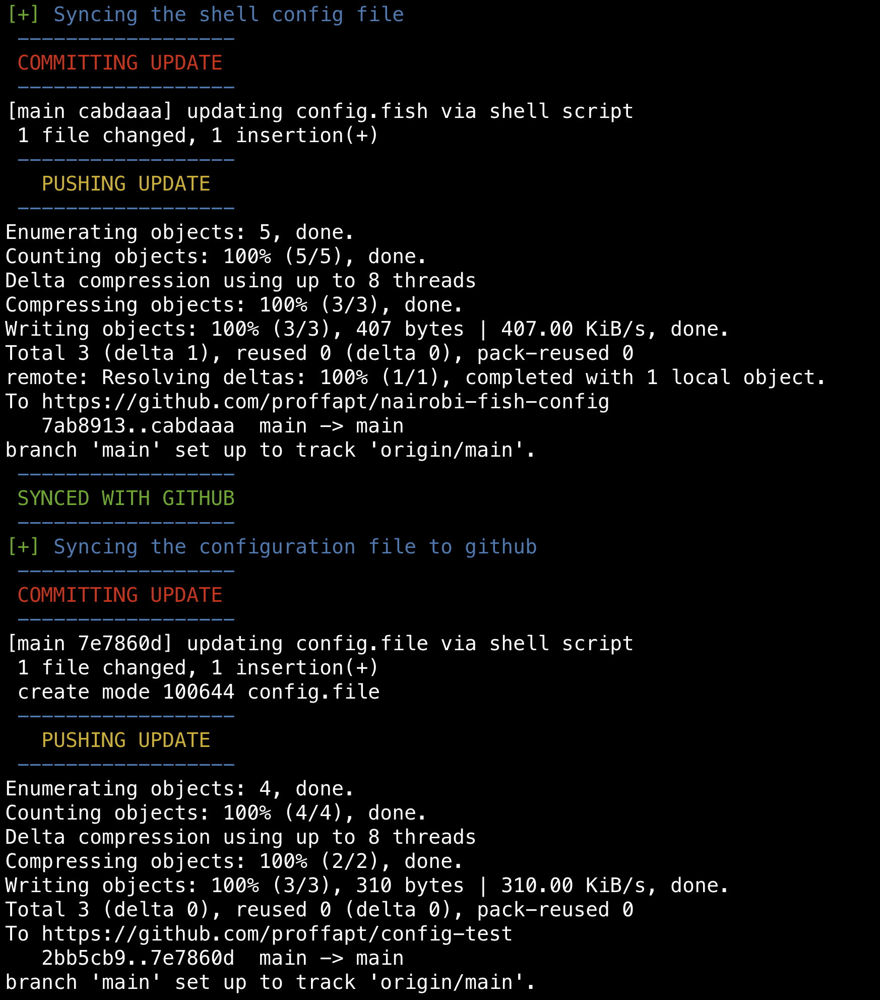
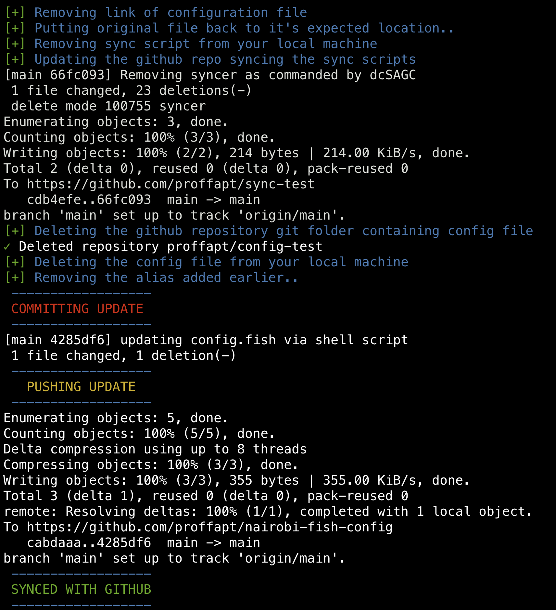

<div id="top"></div>

<!-- PROJECT SHIELDS -->
<!-- https://www.markdownguide.org/basic-syntax/#reference-style-links-->
[![Contributors][contributors-shield]][contributors-url]
[![Forks][forks-shield]][forks-url]
[![Stargazers][stars-shield]][stars-url]
[![Issues][issues-shield]][issues-url]
[![MIT License][license-shield]][license-url]
[![LinkedIn][linkedin-shield]][linkedin-url]
  
  <h3 align="center">dcSAGC</h3>

  <p align="center">
    <i>Automate the unique process(by proffapt) for syncing your configuration from your local machine to github.</i>
    <br />
    <a href="https://github.com/proffapt/dcSAGC"><strong>Explore the docs »</strong></a>
    <br />
    <br />
    <a href="https://github.com/proffapt/dcSAGC/issues">Report Bug</a>
    ·
    <a href="https://github.com/proffapt/dcSAGC/issues">Request Feature</a>
  </p>
</div>


<!-- TABLE OF CONTENTS -->
<details>
  <summary>Table of Contents</summary>
  <ol>
    <li>
      <a href="#about-the-project">About The Project</a>
      <ul>
        <li><a href="#built-with">Built With</a></li>
      </ul>
    </li>
    <li>
      <a href="#getting-started">Getting Started</a>
      <ul>
        <li><a href="#prerequisites">Prerequisites</a></li>
        <li><a href="#installation">Installation</a></li>
      </ul>
    </li>
    <li><a href="#usage">Usage</a></li>
    <li><a href="#roadmap">Roadmap</a></li>
    <li><a href="#contributing">Contributing</a></li>
    <li><a href="#changelog">Change.log</a></li>
    <li><a href="#license">License</a></li>
    <li><a href="#contact">Contact</a></li>
    <li><a href="#acknowledgments">Acknowledgments</a></li>
  </ol>
</details>


<!-- ABOUT THE PROJECT -->
## About The Project

dcSAGC is a very useful tool for those who like to sync their configuration files in real-time to github, so how does it exactly do that? Read the code for detailed understanding.. but for an overview.. here's a short explaination:
* `create mode`:
1. It checks for config file you specified, if it doesn't exist it will create it.
2. Then it sets up the git folder locally and on github used to sync the config file, copies the earlier config file in here and creates a link to this config file in the original location, along with creating README.md file if it doesn't exist and syncs this folder to your remote repo you entered during the process. --> Configuration synced for first time.
3. Then creates a sync file in specified location, if that location is linked with some remote github repo it will sync it there too else will move ahead.
4. Now whenever you will use the specified alias, it will open `nvim`, and after you close it, the sync script will sync the config file to the github repo every time you edit it..
* `delete mode`:
1. Reverses all the mess it made, putting back the config file where it was supposed to be, replacing the link, deleting the github folder.

<p align="right">(<a href="#top">back to top</a>)</p>

### Built With

This project is made with following langs/frameworks.

* Bash


<p align="right">(<a href="#top">back to top</a>)</p>


<!-- GETTING STARTED -->
## Getting Started

To get a local copy up and running follow these simple steps.

### Prerequisites
You will need to install the following dependencies for the project to work.
* `git`
  ```sh
  git confing --global init.defaultBranch main
  git config --global user.name "<enter_your_value>"
  git config --global user.email "<add_your_mail>"
  git config pull.rebase false
  git config credential.helper store
  ```
* `gh`
  ```sh
  gh auth login
  gh auth refresh -h github.com -s delete_repo
  ```
* `nvim`

<p align="right">(<a href="#top">back to top</a>)</p>

### Installation

_Now since we are done with the setting up of environment suitable for the project to compile/run, let's install and configure the project on your system locally now._
1. Clone the repo
   ```sh
   git clone https://github.com/proffapt/dcSAGC.git
   ```
2. Make the script executable
   ```sh
   cd ./dcSAGC
   chmod +x ./dcSAGC
   ```
3. Open the script in your favourite editor and search for `n-fish-ctgs` keyword.
  So basically this alias to my personal sync script for my fish shell config, you can either remove it, or add your own custom alias for the same in place of this.

<p align="right">(<a href="#top">back to top</a>)</p>


<!-- USAGE EXAMPLES -->
## Usage

1. Execute the help menu for script
   ```sh
   ./dcSAGC -h
   ```
<div align="center">
  <a href="https://github.com/proffapt/dcSAGC">
    
  </a>
</div>

2. Use cases for the script are as follows:
* Create mode
  ```sh
  dcSAGC -m create -s ~/sandbox/dcSAGC/sync_file/syncer -a test.e -g ~/sandbox/dcSAGC/git_folder/ -c ~/sandbox/dcSAGC/config_file/config.file
  ```
  <div align="center">
    <a href="https://github.com/proffapt/dcSAGC">
      
    </a>
  </div>
  <div align="center">
    <a href="https://github.com/proffapt/dcSAGC">
      
    </a>
  </div>

* Delete mode
  ```sh
  dcSAGC -m delete -s ~/sandbox/dcSAGC/sync_file/syncer -a test.e -g ~/sandbox/dcSAGC/git_folder/ -c ~/sandbox/dcSAGC/config_file/config.file
  ```
  <div align="center">
    <a href="https://github.com/proffapt/dcSAGC">
      
    </a>
  </div>
3. Source your configuration file!(if other than `bash`)
4. Now if you used `create` mode, use the alias(`test.e` here) to edit your configuration file(`config.file` here), the sync script(`syncer` here)
will do it's job and sync the configuration file to specified github repo.
  ```sh
  test.e
  ```
  <div align="center">
    <a href="https://github.com/proffapt/dcSAGC">
      
    </a>
  </div>
  

<p align="right">(<a href="#top">back to top</a>)</p>


<!-- ROADMAP -->
## Roadmap
- [x] Add the docs to repo
- [x] Add the logic for create mode
- [x] Add the logic for delete mode
- [x] Beautify help menu
- [x] Adding banner
- [x] Completing the Documentation

See the [open issues](https://github.com/proffapt/dcSAGC/issues) for a full list of proposed features (and known issues).

<p align="right">(<a href="#top">back to top</a>)</p>


<!-- CONTRIBUTING -->
## Contributing

Contributions are what make the open source community such an amazing place to learn, inspire, and create. Any contributions you make are **greatly appreciated**.

If you have a suggestion that would make this better, please fork the repo and create a pull request. You can also simply open an issue with the tag "enhancement".
Don't forget to give the project a star! Thanks again!

1. Fork the Project
2. Create your Feature Branch (`git checkout -b feature/AmazingFeature`)
3. Commit your Changes (`git commit -m 'Add some AmazingFeature'`)
4. Push to the Branch (`git push origin feature/AmazingFeature`)
5. Open a Pull Request

<p align="right">(<a href="#top">back to top</a>)</p>


<!-- Changelog -->
# Changelog

## v1.0.0

### Added or Changed
- Added the logic for create mode
- Added the logic for delete mode
- Beautified usage output
- Added Banner
- Adding final documentation

### Removed

- Dropped the idea for saving default values

<p align="right">(<a href="#top">back to top</a>)</p>

<!-- LICENSE -->
## License

Distributed under the BSD-2-Clause License. See `LICENSE.txt` for more information.

<p align="right">(<a href="#top">back to top</a>)</p>


<!-- CONTACT -->
## Contact

Arpit Bhardwaj - [Twitter](https://twitter.com/proffapt) - [Telegram](https://t.me/proffapt) - proffapt@protonmail.com

Company website: [Cybernity](https://cybernity.org) - [CybernityForum](https://cybernity.group)

Project Link: [https://github.com/proffapt/dcSAGC](https://github.com/proffapt/dcSAGC)

<p align="right">(<a href="#top">back to top</a>)</p>


<!-- ACKNOWLEDGMENTS -->
## Acknowledgments

* [Choose an Open Source License](https://choosealicense.com)
* [Img Shields](https://shields.io)
* [GH manual](https://cli.github.com/manual/gh_repo_create)

<p align="right">(<a href="#top">back to top</a>)</p>


<!-- MARKDOWN LINKS & IMAGES -->

[contributors-shield]: https://img.shields.io/github/contributors/proffapt/dcSAGC.svg?style=for-the-badge
[contributors-url]: https://github.com/proffapt/dcSAGC/graphs/contributors
[forks-shield]: https://img.shields.io/github/forks/proffapt/dcSAGC.svg?style=for-the-badge
[forks-url]: https://github.com/proffapt/dcSAGC/network/members
[stars-shield]: https://img.shields.io/github/stars/proffapt/dcSAGC.svg?style=for-the-badge
[stars-url]: https://github.com/proffapt/dcSAGC/stargazers
[issues-shield]: https://img.shields.io/github/issues/proffapt/dcSAGC.svg?style=for-the-badge
[issues-url]: https://github.com/proffapt/dcSAGC/issues
[license-shield]: https://img.shields.io/github/license/proffapt/dcSAGC.svg?style=for-the-badge
[license-url]: https://github.com/proffapt/dcSAGC/blob/master/LICENSE.txt
[linkedin-shield]: https://img.shields.io/badge/-LinkedIn-black.svg?style=for-the-badge&logo=linkedin&colorB=555
[linkedin-url]: https://linkedin.com/in/proffapt
[product-screenshot]: .images/screenshot.png
